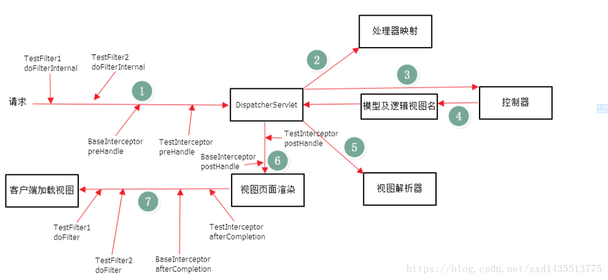

**Spring MVC运行原理**

整个处理过程从一个HTTP请求开始：

1.Tomcat在启动时加载解析web.xml,找到spring mvc的前端总控制器DispatcherServlet,并且通过DispatcherServlet来加载相关的配置文件信息。

2.DispatcherServlet接收到客户端请求，找到对应HandlerMapping，根据映射规则，找到对应的处理器（Handler）。

3.调用相应处理器中的处理方法，处理该请求后，会返回一个ModelAndView。

4.DispatcherServlet根据得到的ModelAndView中的视图对象，找到一个合适的ViewResolver（视图解析器），根据视图解析器的配置，DispatcherServlet将要显示的数据传给对应的视图，最后显示给用户。

  **SpringMVC常用的注解有哪些？** 

------------- @Controller

 @RequestMapping            用于处理请求 url 映射的注解 

 @RequestBody                  注解实现接收http请求的json数据 

 @ResponseBody  			 注解实现将conreoller方法返回对象转化为json对象响应给客户 

## 拦截器（Interceptor）和过滤器（Filter）的执行顺序和区别

Filter需要在web.xml中配置，依赖于Servlet；
Interceptor需要在SpringMVC中配置，依赖于框架；
Filter的执行顺序在Interceptor之前 

</img>
